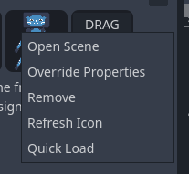
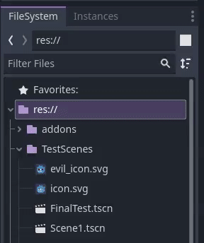
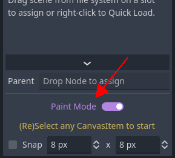
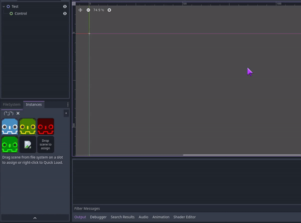
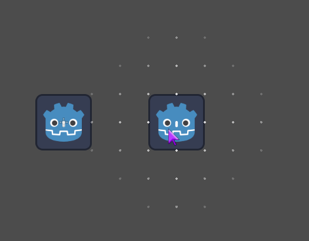
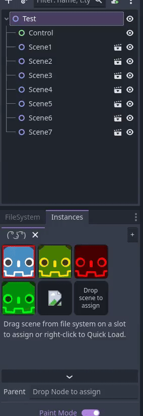

#  Godot Instance Dock
Addon for Godot that adds a handy dock where you can store scenes.

## Using scenes

The scenes are organized into custom tabs. You can add a scene to the dock using drag and drop and then you can drag it onto your scene, as if dragging the scene file.

You can also assign using the Quick Load option.

Use drag and drop within the dock to rearrage the scenes. The dock will automatically add or remove empty slots.

### Scene data

Scene data is saved in a designated file, which by default is `res://InstanceDockSceneData.txt`. You can change the data file by modifying `addons/instance_dock/scene_data_file` project setting (if the file exists, it will be automatically moved).

## Advanced options

Every scene slot has a right-click menu.

- Open Scene: Opens the scene in editor.
- Override Properties: Edits the instance in the inspector to allow changing its properties.
- Remove: Removes the scene from slot.
- Refresh Icon: Forces the scene icon to refresh. The icons are cached, so if you edit a scene, you need to refresh the preview. Icon is refreshed automatically when changing overrides.
- Quick Load: Opens a Quick Load menu to assign a scene.

### Property overrides

You can override any property in the instance and the override is applied when you instance the scene. Instance dock keeps override data internally, so you can have multiple versions of the same scene. Instances with overrides have a green marker in the corner.

### Icons

The icons are automatically generated from the scenes. The method for generation is basically: instantiate the scene inside viewport, move it to the center (if it's Node2D), take snapshot. The default icon resolution (viewport size) is 64x64. You can change it by modifying `addons/instance_dock/preview_resolution` project setting (it does not affect the slot size, which is always 64x64). If the icon turns out fully transparent, it will show a placeholder:

Since the icons only support 2D and aren't always 100% accurate, there is an option to assign a custom icon. Just drop any Texture2D onto a slot to assign icon.

It supports any Texture2D type and scenes with custom icons have a faint outline. Use the context menu to remove the custom texture.

The icons are created when the dock is opened for the first time. It may take some time, so a loading icon will appear.

Afterwards the icons are cached inside `InstanceIconCache` subdirectory of your `.godot` folder, so they load faster. The cache can be invalidated by refreshing the icon manually from the context menu.

## Painting mode

This feature allows you to draw the scenes directly in the 2D viewport, without needing to drag and drop. It supports basic grid snapping and allows for faster placement of multiple instances.

You can access it by unfolding the bottom subpanel and enabling Paint Mode.

Due to engine limitations, you need to select a CanvasItem (Node2D or Control) in the scene tree to start painting. You can select scenes by clicking them (Paint Mode disables drag and drop) and then draw with left mouse button.

When you enable Snap, the editor will display a basic grid near the cursor and the instance will be snapped to the grid. With snap enabled you can also paint continuously.

### Default parent

When painting, the instances are by default created under the selected Node. You can change the default parent node by drag and dropping a node to the Parent field.

When not using Paint Mode, the scenes from the dock have the same dragging behavior as scenes from FileSystem, i.e. the Node is added to scene root by default, hold Ctrl to add it as child of the selected node, hold Shift to add it as sibling of the selected node. If a default Parent is assigned and the node is added under the scene root, it automatically gets reparented to the selected parent.

___
You can find all my addons on my [profile page](https://github.com/KoBeWi).

